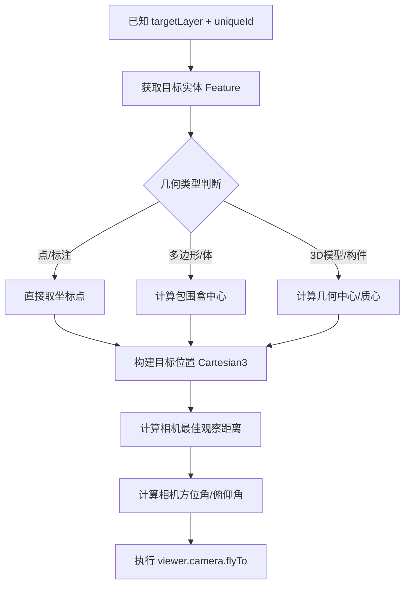

# 基于“构建”的Cesium精准定位逻辑实现

## 问题理解

您希望在已知 `targetLayer` 和 `uniqueId` 的情况下，**通过自主构建定位逻辑**来实现更精准的定位，而非直接使用图层自带的 `zoomTo` 或 `flyTo` 方法。这通常是因为：

- 图层自带定位可能只飞到图层整体范围，不够精确
- 需要定位到建筑内部的特定构件、楼层或房间
- 需要自定义相机视角（俯仰角、偏航角、距离）
- 需要结合建筑包围盒实现“贴地”或“贴面”效果

---

## 核心定位逻辑架构



---

## 关键实现步骤

### 第一步：通过 uniqueId 获取目标实体

在 SuperMap + Cesium 环境下，S3M 图层通常使用 `Cesium3DTileset`，需要通过遍历 tiles 或使用 `getFeatureById` 获取：

```javascript
function getFeatureByUniqueId(layer, uniqueId) {
    let targetFeature = null;
    
    // 方式一：遍历 tileset 的所有 features（适用于 S3M）
    if (layer._cesiumTileset) {
        const tileset = layer._cesiumTileset;
        const features = tileset.features;
        for (let i = 0; i < features.length; i++) {
            const feature = features[i];
            // 根据属性字段匹配 uniqueId
            if (feature.getProperty('uniqueId') === uniqueId || 
                feature.getProperty('id') === uniqueId ||
                feature.getProperty('SMID') === uniqueId) {
                targetFeature = feature;
                break;
            }
        }
    }
    
    // 方式二：通过 SuperMap 数据服务查询（适用于矢量/属性数据）
    if (!targetFeature) {
        // 使用 SuperMap.QueryService 进行属性查询
        // 详见下文示例
    }
    
    return targetFeature;
}
```

### 第二步：构建精确的定位点

这是“构建”定位的核心 —— 根据几何特征自主计算目标点：

```javascript
function buildPrecisePosition(feature, options = {}) {
    const {
        offsetHeight = 0,        // 高度偏移
        useBoundingBoxCenter = true,
        floorLevel = null        // 楼层级别
    } = options;
    
    let position;
    
    // 1. 获取几何数据
    const geometry = feature.geometry;
    
    if (geometry) {
        // 矢量数据：计算几何中心
        const positions = geometry.positions || geometry.coordinates;
        const center = calculateCenter(positions);
        position = Cesium.Cartesian3.fromDegrees(center.lng, center.lat, center.height + offsetHeight);
    } else if (feature._boundingVolume) {
        // 2. 使用 Cesium 内置包围盒计算中心（更准确）
        const boundingVolume = feature._boundingVolume;
        const boundingSphere = Cesium.BoundingSphere.fromBoundingVolume(boundingVolume);
        position = boundingSphere.center.clone();
        position.z += offsetHeight;
    } else if (feature._content && feature._content._tileset) {
        // 3. 从 tile 的变换矩阵推算位置
        const tile = feature._content._tile;
        const boundingVolume = tile.boundingVolume;
        const center = getBoundingVolumeCenter(boundingVolume);
        position = center;
    } else {
        // 4. 降级方案：从 feature 的属性中读取位置
        const lng = feature.getProperty('longitude') || feature.getProperty('x');
        const lat = feature.getProperty('latitude') || feature.getProperty('y');
        const height = feature.getProperty('height') || feature.getProperty('z') || 0;
        position = Cesium.Cartesian3.fromDegrees(lng, lat, height + offsetHeight);
    }
    
    return position;
}

// 计算多边形几何中心
function calculateCenter(positions) {
    let lngSum = 0, latSum = 0, heightSum = 0;
    let count = 0;
    for (let pos of positions) {
        if (Array.isArray(pos)) {
            lngSum += pos[0];
            latSum += pos[1];
            heightSum += pos[2] || 0;
            count++;
        }
    }
    return {
        lng: lngSum / count,
        lat: latSum / count,
        height: heightSum / count
    };
}

// 获取包围盒中心（处理多种包围盒类型）
function getBoundingVolumeCenter(boundingVolume) {
    if (boundingVolume._boundingSphere) {
        return boundingVolume._boundingSphere.center;
    }
    if (boundingVolume._boundingBox) {
        const box = boundingVolume._boundingBox;
        const center = new Cesium.Cartesian3(
            (box.minimum.x + box.maximum.x) / 2,
            (box.minimum.y + box.maximum.y) / 2,
            (box.minimum.z + box.maximum.z) / 2
        );
        return center;
    }
    if (boundingVolume._orientedBoundingBox) {
        const obb = boundingVolume._orientedBoundingBox;
        return obb.center.clone();
    }
    return boundingVolume.center || new Cesium.Cartesian3(0, 0, 0);
}
```

### 第三步：计算最佳相机视角

根据目标物体的尺寸动态计算相机距离和角度：

```javascript
function calculateCameraParams(position, feature, options = {}) {
    const {
        defaultDistance = 200,    // 默认距离
        minDistance = 50,
        maxDistance = 1000,
        heading = 0,              // 偏航角（度）
        pitch = -30,             // 俯仰角（度），负值表示俯视
        roll = 0
    } = options;
    
    // 1. 估算目标物体尺寸
    let radius = 50; // 默认半径
    if (feature._boundingVolume) {
        const sphere = Cesium.BoundingSphere.fromBoundingVolume(feature._boundingVolume);
        radius = sphere.radius || 50;
    } else if (feature._content && feature._content._tile) {
        const tile = feature._content._tile;
        const boundingVolume = tile.boundingVolume;
        const sphere = Cesium.BoundingSphere.fromBoundingVolume(boundingVolume);
        radius = sphere.radius || 50;
    }
    
    // 2. 根据物体尺寸计算最佳距离（让物体占据视口 30%~40%）
    const fov = viewer.camera.frustum.fov || Cesium.Math.toRadians(60);
    const optimalDistance = Math.max(minDistance, Math.min(maxDistance, radius / Math.tan(fov / 2) * 1.2));
    
    // 3. 如果物体较大，适当拉远距离
    const finalDistance = Math.max(radius * 1.5, optimalDistance);
    
    return {
        destination: position,
        orientation: {
            heading: Cesium.Math.toRadians(heading),
            pitch: Cesium.Math.toRadians(pitch),
            roll: Cesium.Math.toRadians(roll)
        },
        distance: finalDistance,
        duration: 2.0,           // 飞行时间（秒）
        complete: () => {
            console.log('定位完成，距离:', finalDistance);
        }
    };
}
```

### 第四步：执行定位飞行

```javascript
function flyToBuilding(targetLayer, uniqueId, options = {}) {
    // 1. 获取目标实体
    const feature = getFeatureByUniqueId(targetLayer, uniqueId);
    if (!feature) {
        console.error(`未找到 uniqueId 为 ${uniqueId} 的实体`);
        return false;
    }
    
    // 2. 构建精确位置
    const position = buildPrecisePosition(feature, options);
    if (!position) {
        console.error('无法构建目标位置');
        return false;
    }
    
    // 3. 计算相机参数
    const cameraParams = calculateCameraParams(position, feature, options);
    
    // 4. 执行飞行
    viewer.camera.flyTo({
        destination: cameraParams.destination,
        orientation: cameraParams.orientation,
        duration: options.duration || 2.0,
        complete: cameraParams.complete
    });
    
    return true;
}
```

---

## 完整调用示例

```javascript
// 1. 获取图层
const scene = viewer.scene;
const layer = scene.layers.find('建筑物图层'); // 替换为实际图层名

// 2. 执行定位
flyToBuilding(layer, 'BUILDING_001', {
    offsetHeight: 10,          // 在建筑中心基础上抬高10米
    heading: 45,               // 从东北方向观察
    pitch: -25,               // 俯视角度25度
    duration: 2.5,            // 飞行耗时2.5秒
    defaultDistance: 300,     // 默认观察距离300米
    floorLevel: 5             // 可扩展：定位到第5层
});
```

---

## 进阶：楼层/构件级定位

如果需要定位到建筑内部的**特定楼层**或**构件**，可以扩展 `buildPrecisePosition`：

```javascript
function buildPositionWithFloor(position, floorLevel, floorHeight = 3.5) {
    // 假设建筑底部高度为 position.z，每层楼高 floorHeight
    const floorZ = position.z + floorLevel * floorHeight;
    return new Cesium.Cartesian3(position.x, position.y, floorZ);
}
```

对于**构件级定位**（如窗户、柱子），需要从模型中提取构件 ID：

```javascript
// 通过构件 ID 定位
function locateComponent(buildingFeature, componentId) {
    // 遍历 buildingFeature 的子构件
    // 获取构件的局部坐标 -> 转换为世界坐标
    // 执行定位
}
```

---

## 精度优化建议

| 优化点 | 说明 |
|--------|------|
| **包围盒优先** | 使用 `BoundingVolume` 计算中心比单纯取坐标点更准确 |
| **LOD 预加载** | 定位前确保目标 tiles 已加载，否则包围盒可能为空 |
| **地形修正** | 使用 `sampleTerrain` 获取地表高程，避免悬空或穿地 |
| **视口适配** | 根据物体尺寸动态调整相机距离，确保完整展示 |
| **动画平滑** | 使用 `flyTo` 的 `duration` 和 `easingFunction` 控制飞行曲线 |

```javascript
// 地形修正示例
async function correctHeight(position) {
    const cartographic = Cesium.Cartographic.fromCartesian(position);
    const terrainHeight = await Cesium.sampleTerrain(viewer.terrainProvider, 11, [
        Cesium.Cartographic(cartographic.longitude, cartographic.latitude)
    ]);
    const height = Math.max(cartographic.height, terrainHeight[0].height + 5);
    return Cesium.Cartesian3.fromRadians(
        cartographic.longitude, 
        cartographic.latitude, 
        height
    );
}
```

---

## 与 targetLayer 定位的对比

| 定位方式 | 精度 | 可控性 | 适用场景 |
|----------|------|--------|----------|
| `layer.zoomTo()` | 图层整体范围 | 低 | 快速概览 |
| 基于包围盒构建定位 | **高（单建筑/构件级）** | **高** | 精准查看、巡检、导航 |
| 混合定位（包围盒+属性） | 最高 | 完全自定义 | 复杂业务场景 |

---

## 总结

基于“构建”的定位逻辑核心在于：

1. **自主获取几何数据** —— 不依赖图层的 `zoomTo`，而是从 feature 的 `boundingVolume`、`geometry` 或 `tile` 中提取
2. **精确计算目标点** —— 使用包围盒中心、几何质心等，而非简单取第一个顶点
3. **动态适配相机** —— 根据物体尺寸自动计算最佳观察距离和角度
4. **可扩展性** —— 支持楼层、构件级定位，满足业务深度需求

这种方法在 SuperMap + Cesium 11.2.1 环境下完全可行，能够实现比原生 `zoomTo` 更精准、更可控的定位效果。